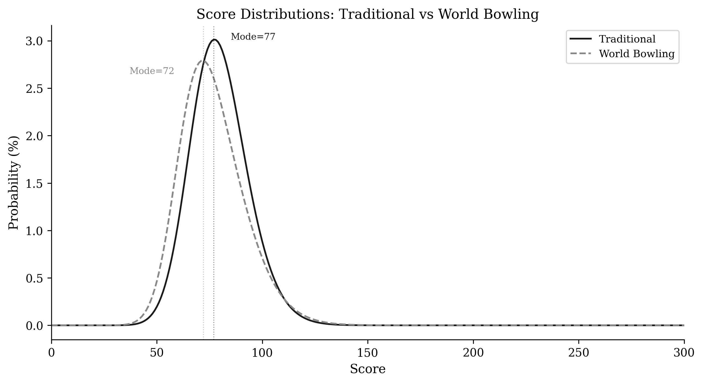
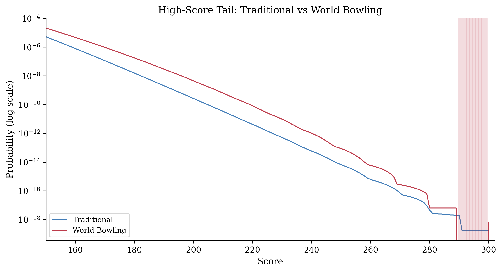
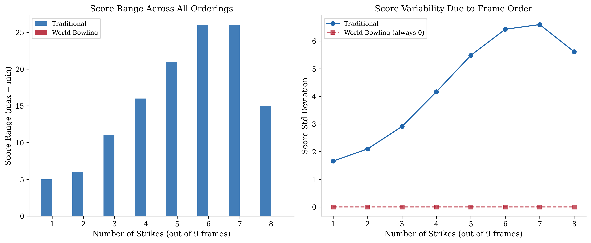
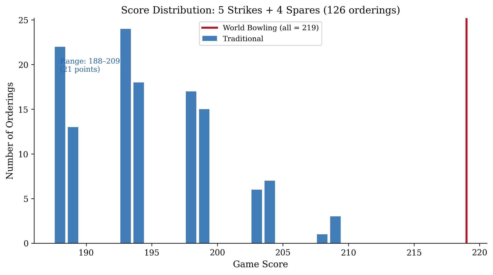
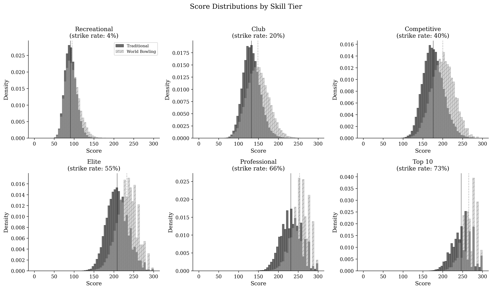
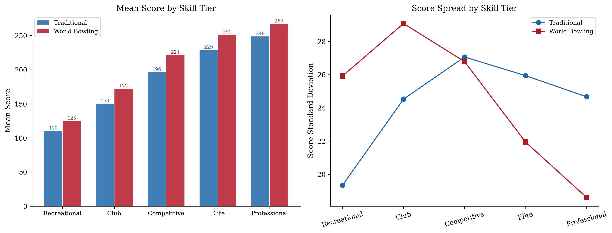
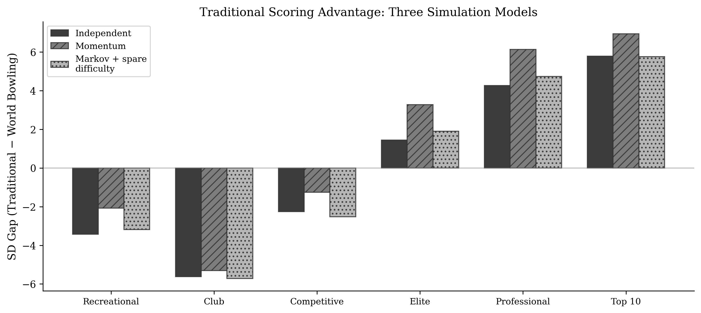
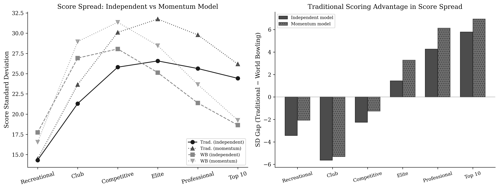

# Introduction

Ten-pin bowling has been scored using the same traditional system for over a century. Under this system, a strike earns ten pins plus the total of the next two balls thrown, and a spare earns ten pins plus the next ball. This forward-looking bonus structure creates scoring dependencies across frames, rewarding sustained performance non-linearly.

World Bowling, the international governing body for the sport, has promoted an alternative current-frame scoring system [@worldbowling2014] in which each frame is scored independently: a strike earns 30 points, a spare earns 10 plus the first ball of that frame, and an open frame earns the sum of both balls. The stated motivation is simplicity: spectators and new participants can follow the score without tracking future balls. This push has intensified as the International Bowling Federation pursues Olympic inclusion, where broadcast accessibility is a key selection criterion [@insidethegames2014], and has culminated in the launch of international franchise competitions using current-frame scoring exclusively [@reuters2025wbl]. The question of whether this simplification preserves the competitive properties the sport requires at the elite level is therefore not academic. It is an active governance decision with immediate consequences.

A simple example illustrates the core difference. Consider two players who each throw five strikes and four spares across frames 1–9, followed by an identical frame 10. Under World Bowling, both players score 219, regardless of whether the strikes were consecutive or scattered throughout the game. Under traditional scoring, the player who placed strikes consecutively scores up to 20 points higher than one who alternated. The same frames, in different order, produce the same World Bowling score but meaningfully different traditional scores. This paper asks: does this distinction matter, and at what skill level does it become competitively significant?

Several informal comparisons of these systems exist online, focusing primarily on average scores and the presence of impossible scores in the World Bowling range. @cooper1990 provided the foundational mathematical treatment of traditional bowling score distributions using generating functions, later extended by @hohn2009 to generalised N-frame, M-pin games. @keogh2011 studied empirical bowling score distributions using real game data. However, no prior work has formally compared the mathematical properties of both scoring systems, characterised sequence sensitivity as a distinguishing property, or quantified the skill level at which scoring system choice becomes competitively significant.

This paper provides that treatment in two complementary parts: exact mathematical analysis (Part 1) and skill-weighted simulation (Part 2).

# Part 1: Mathematical Analysis {.unnumbered}

# Mathematical Framework

## State Space and Enumeration

The total number of distinct ten-pin bowling games is finite and well-defined. Under traditional scoring, each of frames 1–9 admits 66 possible throwing outcomes (one strike, plus all combinations of two balls summing to at most 10), and frame 10 admits 241 outcomes (accounting for bonus balls). The total game count is therefore:

$$66^9 \times 241 = 5{,}726{,}805{,}883{,}325{,}784{,}576 \approx 5.7 \times 10^{18}$$

Under World Bowling scoring, all ten frames are identical (no bonus ball in frame 10), giving:

$$66^{10} = 1{,}568{,}336{,}880{,}910{,}795{,}776 \approx 1.6 \times 10^{18}$$

Direct enumeration of these game spaces is computationally infeasible, and the resulting distributions are highly multimodal and non-normal, as demonstrated empirically by @mccarthy2011 using PBA tournament data, ruling out simple parametric approximations. We therefore employ dynamic programming with state representation tracking pending bonus multipliers, following the convolution approach described by @balmoral. The key insight is that the score contribution of each ball depends only on the current pending bonus state, not on the full history of prior balls, allowing the computation to proceed frame by frame with a manageable number of distinct states (on the order of hundreds of thousands, rather than quintillions of complete games).

Our independent implementation produces results that match their published tables exactly at every verification point. These include the mode of 77 for traditional scoring with 172,542,309,343,731,946 possible games, and the mode of 72 for World Bowling scoring with 43,781,414,679,391,290 possible games.

## Scoring Functions

**Traditional scoring:**
For frames 1–9, let $A_i$ and $B_i$ denote the first and second balls of frame $i$. For a strike ($A_i = 10$), the frame score is $10 + A_{i+1} + B_{i+1}$. For a spare ($A_i + B_i = 10$), the frame score is $10 + A_{i+1}$. Otherwise the frame score is $A_i + B_i$. Frame 10 follows special rules permitting up to three balls with no bonus propagation beyond the frame.

**World Bowling scoring:**
For each frame $i$, the score is: 30 (strike), $10 + A_i$ (spare), or $A_i + B_i$ (open). All ten frames are scored identically; no inter-frame dependencies exist.

# Score Distributions

## Summary Statistics

| Statistic | Traditional | World Bowling |
|-----------|-------------|---------------|
| Total games | $5.73 \times 10^{18}$ | $1.57 \times 10^{18}$ |
| Score range | 0–300 | 0–289, 300 |
| Mode | 77 | 72 |
| Mean | 79.7 | 76.5 |
| Median | 79 | 75 |
| Standard deviation | 13.7 | 15.2 |

: Summary statistics for exact score distributions under uniform random play. {#tbl-summary}

{#fig-distribution width=100%}

## Impossible Scores

A structural property of World Bowling scoring is the impossibility of scores in the range 290–299. This arises because 9 strikes yield at most $9 \times 30 + 19 = 289$ (9 strikes plus one maximum spare of 10 + 9), while 10 strikes yield exactly 300. No sequence of legal balls can produce a game score between 290 and 299 inclusive under World Bowling rules. This gap is not a curiosity; it is a direct consequence of the linear, frame-independent scoring structure, and it reveals a fundamental property: **the score space is not fully utilised**.

{#fig-tail width=100%}

## High-Score Compression

The number of distinct game sequences producing each high score differs markedly between systems:

| Score | Traditional | World Bowling |
|-------|-------------|---------------|
| 200 | 1,526,313,637 | 7,019,752,752 |
| 240 | 335,065 | 1,599,447 |
| 260 | 3,534 | 9,225 |
| 280 | 26 | 10 |
| 290 | 11 | 0 (impossible) |
| 300 | 1 | 1 |

: Number of distinct game sequences producing each high score. {#tbl-compression}

At scores of 200 and above, World Bowling consistently offers more paths to the same score. This score compression means the score scale is coarser at the top: more distinct games collapse onto the same number, leaving fewer available values to separate high-scoring performances. Whether a coarser scale also reduces the system's ability to discriminate *player skill*, as opposed to merely separating individual games, is a separate question that the raw counts here cannot settle; we address it directly with a signal-to-noise reliability analysis in Part 2.

# Sequence Sensitivity

## Commutativity of World Bowling Scoring

**Proposition 1.** *Under World Bowling scoring, the total game score is invariant under any permutation of the ten frames.*

*Proof.* Let $f_i$ denote the score of frame $i$ under World Bowling rules. The total game score is $S = \sum_{i=1}^{10} f_i$. Since each $f_i$ is computed from balls thrown within frame $i$ alone, and addition is commutative and associative, any permutation $\sigma$ of the frames yields $S' = \sum_{i=1}^{10} f_{\sigma(i)} = S$. $\square$

This property, commutativity with respect to frame order, does not hold for traditional scoring. Under traditional scoring, a strike in frame $i$ depends on balls thrown in frames $i+1$ and potentially $i+2$. Reordering frames changes which balls serve as bonuses, and therefore changes the score.

## Empirical Demonstration

We compute scores for fixed frame compositions under varying orderings. Consider 9 frames comprising 5 strikes and 4 spares (5,5) in various orderings, followed by a neutral frame 10 (5, 4):

| Sequence (9 frames + neutral 10th) | Traditional | World Bowling |
|------------------------------------|-------------|---------------|
| 5 strikes then 4 spares | 204 | 219 |
| Alternating: strike, spare × 4, strike | 188 | 219 |
| 4 spares then 5 strikes | 208 | 219 |
| X, sp, sp, X, sp, X, X, sp, X | 188 | 219 |

: Scores for four orderings of the same frame composition (5 strikes + 4 spares). {#tbl-sequence}

Under World Bowling, all four orderings score identically (219). Under traditional scoring, the score varies by 20 points (188–208) depending solely on the ordering.

{#fig-sequence width=100%}

## Exhaustive Permutation Analysis

To quantify the full extent of sequence sensitivity, we enumerate all distinct permutations of fixed frame compositions and compute the score under each system. For compositions of $k$ strikes and $(9-k)$ spares in frames 1–9:

| Composition | Orderings | Trad. range | Trad. SD | WB range |
|---|---|---|---|---|
| 1 strike + 8 spares | 9 | 5 | 1.7 | 0 |
| 2 strikes + 7 spares | 36 | 6 | 2.1 | 0 |
| 3 strikes + 6 spares | 84 | 11 | 2.9 | 0 |
| 4 strikes + 5 spares | 126 | 16 | 4.2 | 0 |
| 5 strikes + 4 spares | 126 | 21 | 5.5 | 0 |
| 6 strikes + 3 spares | 84 | 26 | 6.4 | 0 |
| 7 strikes + 2 spares | 36 | 26 | 6.6 | 0 |
| 8 strikes + 1 spare | 9 | 15 | 5.6 | 0 |

: Exhaustive permutation analysis. Traditional score range and standard deviation grow with the mix of frame types; World Bowling range is exactly zero for every composition. {#tbl-permutations}

The World Bowling score range is exactly zero for every composition, confirming Proposition 1 empirically. The traditional score range grows with the mix of frame types, peaking at 26 points for compositions with 6–7 strikes. When open frames are included alongside strikes, the range increases further: 5 strikes mixed with 4 open frames (5, 4) produces a 39-point range across 126 orderings.

{#fig-permvar width=100%}

{#fig-permdist width=100%}

## Implications for Skill

Sequence sensitivity has a direct sporting interpretation. In competitive bowling, a player who strings consecutive strikes together is demonstrating a qualitatively different level of performance than one who scatters the same number of strikes throughout a game. The traditional scoring system encodes this distinction numerically. The World Bowling system does not.

The maximum score achievable with a fixed number of strikes is higher when those strikes are consecutive (due to compounding bonuses from subsequent strikes), creating a score incentive for sustained excellence. Under World Bowling, a bowler who throws five consecutive strikes in frames 1–5 and then opens all remaining frames achieves the same score as one who alternates strikes and open frames, regardless of how much more difficult the sustained streak was to achieve.

# The Reward Gradient for Consecutive Strikes

We define the **marginal strike value** as the increase in game score when one additional open frame (5, 4) is replaced by a strike, all other frames remaining constant. Under World Bowling this value is trivially constant: $30 - 9 = 21$ points per strike added.

Under traditional scoring, the marginal value depends on the surrounding context:

| Consecutive strikes | Trad. Score | World Score | Trad. Marginal | World Marginal |
|---|---|---|---|---|
| 0 | 90 | 90 | n/a | n/a |
| 1 | 100 | 111 | +10 | +21 |
| 2 | 116 | 132 | +16 | +21 |
| 3 | 137 | 153 | +21 | +21 |
| 4 | 158 | 174 | +21 | +21 |
| 5 | 179 | 195 | +21 | +21 |
| 10 | 300 | 300 | +37 | +21 |

: Marginal value of each additional consecutive strike. {#tbl-gradient}

Two observations are immediate. First, the initial strikes are undervalued in traditional scoring relative to World Bowling: the first strike adds only 10 points compared to 21 under World Bowling. This is because the bonus from a lone strike depends on subsequent balls that are in this model open frames (5, 4 = 9 pins), capping the bonus at 9. Second, the final strike in a perfect game is worth 37 points under traditional scoring, substantially more than World Bowling's flat 21, because it is preceded by two strikes that each earn its bonus retroactively.

This structure rewards the *completion* of a skill streak more than its initiation. The first strike of a sequence is worth relatively little; the strike that extends a string is worth substantially more. Under World Bowling, every strike is worth exactly the same regardless of what surrounds it.

{#fig-gradient width=100%}

# Part 2: Skill-Weighted Simulation {.unnumbered}

# Simulation Model

## Player Model

To ground the mathematical analysis in realistic playing conditions, we simulate bowling games across six empirically motivated skill tiers. Each player is characterised by three parameters: strike probability ($p_s$), spare conversion probability ($p_{sp}$), and mean first-ball pin count when not striking. Tier parameters were calibrated against published data from multiple sources: @mccarthy2011 reports a mean score of 205.65 (SD 31.91) across 278,579 PBA National Tour games, with individual bowler ability estimates ranging from approximately 150 to 235; @vanderwerken2018 reports posterior mean strike probabilities ranging from approximately 53% to 66% across 53 PBA bowlers; and USBC published league averages anchor the recreational end.

| Skill Tier | Strike Rate | Spare Rate | Pin Mean | Target Trad. Mean |
|---|---|---|---|---|
| Recreational | 4% | 27% | 4.2 | ~90 |
| Club | 20% | 47% | 5.5 | ~130 |
| Competitive | 40% | 64% | 6.5 | ~175 |
| Elite | 55% | 77% | 7.2 | ~210 |
| Professional | 66% | 86% | 7.8 | ~230 |
| Top 10 | 73% | 92% | 8.2 | ~245 |

: Skill tier parameters. The recreational tier targets casual bowlers based on USBC league averages. The professional tier targets the PBA Tour season average of approximately 230, consistent with the upper range of bowler ability estimates reported by @mccarthy2011. The Top 10 tier (73% strike rate) is extrapolated from the upper tail of the professional ability distribution, representing the elite end of PBA performance [@yaari2012; @vanderwerken2018]. {#tbl-tiers}

## Simulation Protocol

We employ three progressively realistic simulation models to ensure robustness of results:

1. **Independent model (base case).** Each ball is generated independently: the first ball of each frame is a strike with probability $p_s$, otherwise pins follow a binomial distribution; the second ball converts the spare with flat probability $p_{sp}$.

2. **Momentum model.** Strike probability increases by 5 percentage points after a strike and decreases after an open frame, capturing the simplest form of sequential dependence.

3. **Markov chain model with spare difficulty.** Strike probability follows a first-order Markov chain with state-dependent transition probabilities informed by the empirical hot-hand magnitudes reported in @vanderwerken2018, who built on the streak probability framework of @martin2006 to fit 4th-order Markov models to 26,102 PBA tournament games from 53 professional bowlers. Their posterior estimates show strike probability increasing by approximately 5–10 percentage points after consecutive strikes relative to a cold state. We apply conservative first-order transition ratios: $P(\text{strike} \mid \text{prev. strike}) = p_s \times 1.15$, $P(\text{strike} \mid \text{prev. spare}) = p_s \times 0.95$, $P(\text{strike} \mid \text{prev. open}) = p_s \times 0.85$. Spare conversion is leave-dependent, with three difficulty classes consistent with the non-strike leave distributions reported in @vanderwerken2018 Tables 7–8: easy single-pin leaves (55% of non-strike results, high conversion), moderate multi-pin leaves (35%, baseline conversion), and splits (10%, conversion rate reduced to 30% of baseline).

For each skill tier, we simulate 50,000 complete games under each model. Every simulated game is scored under both traditional and World Bowling rules, enabling paired comparison. The independent model provides a conservative lower bound; the Markov model provides the most realistic estimate.

## Tier Results

| Skill Tier | Traditional Mean (SD) | World Bowling Mean (SD) |
|---|---|---|
| Recreational | 91 (14.2) | 95 (17.7) |
| Club | 133 (21.2) | 149 (26.8) |
| Competitive | 176 (25.8) | 200 (28.1) |
| Elite | 209 (26.6) | 233 (25.1) |
| Professional | 232 (25.7) | 253 (21.4) |
| Top 10 | 246 (24.4) | 265 (18.6) |

: Simulated score statistics by skill tier (50,000 games each). {#tbl-tierresults}

{#fig-tierdist width=100%}

{#fig-tiermeans width=100%}

# The Score Spread Crossover

## Standard Deviation as a Function of Skill

A critical observation emerges from the simulation: the standard deviation of scores under each system behaves differently as a function of player skill.

Under World Bowling, score standard deviation peaks at low-to-moderate skill levels (SD $\approx$ 28 at competitive level) and then **decreases monotonically** as skill increases, reaching SD $\approx$ 18.6 at the Top 10 level. This compression occurs because high-skill World Bowling games converge toward the maximum of 300. With most frames scoring 30 (strike), the remaining variance comes only from occasional non-strikes.

Under traditional scoring, standard deviation increases with skill through the competitive range and remains elevated (SD $\approx$ 25.7 at professional, $\approx$ 24.4 at Top 10). This is because the compounding bonus structure amplifies the consequences of each non-strike: a single open frame in an otherwise perfect game costs substantially more under traditional scoring than under World Bowling, maintaining score spread even at elite levels.

## The Crossover Point

We sweep strike rate continuously from 10% to 80% and compute score standard deviation under each system. The two curves cross at a strike rate of **48.7%** (95% bootstrap confidence interval 48.2%–49.1%, from 500 resamples of the simulated games). Below this threshold, World Bowling produces greater score spread; above it, traditional scoring produces greater spread.

It is tempting to read this crossover as a crossover in *discrimination*, with World Bowling separating players better below 50% and traditional scoring better above it. That reading is wrong, and correcting it is the central methodological point of this section. Standard deviation measures how wide the score distribution is, not how much of that width reflects genuine differences in player ability. A scoring system can inflate its standard deviation purely by amplifying the consequences of a single lucky or unlucky ball, which is noise, not skill. The next two subsections decompose the spread into signal and noise and show that, on the axis of raw skill, the extra spread traditional scoring carries at elite levels is mostly the latter. The crossover is best understood as a statement about score *granularity and margins*, the size of the gaps between scores, rather than about how reliably a single game ranks two players.

{#fig-crossover width=100%}

## Signal versus Noise: A Reliability Analysis

The standard deviation of game scores conflates two very different things: genuine, persistent differences between players (signal) and game-to-game variation for a single fixed player (noise). A scoring system that simply magnifies the score impact of a single ball will show a large standard deviation without discriminating skill any better. To separate the two, we treat each scoring system as a measurement instrument and estimate its single-game reliability.

For a target skill level, we construct a population of players whose true strike rates differ by a realistic amount (a standard deviation of three strike-rate points, reflecting the within-neighbourhood ability spread among players nominally at the same level; cf. the roughly 53%–66% posterior strike-rate range across 53 PBA bowlers in @vanderwerken2018). We simulate many games per player, score every game under both systems from the *same* ball sequences, and decompose the total score variance into a between-player component $\sigma_B^2$ and a within-player component $\sigma_W^2$. The single-game reliability is the intraclass correlation $\text{ICC} = \sigma_B^2 / (\sigma_B^2 + \sigma_W^2)$: the fraction of one game's score variance attributable to real skill differences. A higher ICC means a single game more reliably identifies the better player.

Two findings emerge (@fig-reliability). First, the two systems have nearly identical single-game reliability at every skill level, differing by less than 0.01 in ICC across the full 10%–78% strike-rate range. On the axis of raw skill, traditional scoring is no better at separating players than World Bowling. Second, the variance decomposition explains why traditional scoring's larger elite-level spread does not buy discrimination: at the top of the range, almost all of the extra spread is noise. At a 78% strike rate, traditional scoring's within-player (noise) standard deviation is about 24 points against World Bowling's 17, while the between-player (signal) standard deviations are comparable and small (roughly 6 versus 4 points). The amplifying bonus structure inflates noise and signal together, leaving their ratio, and hence reliability, essentially unchanged.

This result aligns with the between-tier comparison: across adjacent skill tiers, both systems produce nearly identical Cohen's $d$ effect sizes, from 2.3 (recreational vs club) down to 0.6 (professional vs Top 10), matching to within 0.03 at every boundary. Whether one measures discrimination between tiers or reliability within a population, the two systems are equivalent on raw skill. The case for traditional scoring cannot rest on the standard-deviation crossover, and we do not rest it there.

{#fig-reliability width=100%}

## Discriminating Streakiness at Fixed Skill

If the two systems are equally reliable on raw skill, where does commutativity actually cost something? Precisely where Proposition 1 predicts: in measuring *how* a player arranges a fixed number of strikes. To isolate this, we hold the marginal strike rate constant and vary only the lag-1 autocorrelation $\phi$ of the strike indicator, the tendency to throw strikes in runs rather than scattering them. A two-state Markov chain lets us set any autocorrelation while keeping the expected strike count fixed, so two players with different $\phi$ are identical in raw skill and differ only in streakiness. The magnitude range we sweep ($\phi$ up to 0.35) spans the hot-hand effect sizes reported for professional bowlers by @vanderwerken2018.

The contrast is stark (@fig-streakiness). Across a population of players who share a 66% strike rate but differ in streakiness, a player's mean traditional score correlates with true streakiness at $r = 0.49$, while the World Bowling correlation is $r = -0.04$, indistinguishable from zero. Comparing the extremes directly, a maximally streaky player ($\phi = 0.35$) outscores a streak-free player ($\phi = 0$) of identical raw skill by about seven points under traditional scoring (235.5 vs 228.6; Cohen's $d = 0.23$), but by nothing under World Bowling (250.6 vs 251.2; $d = -0.02$). World Bowling is not merely noisier at detecting streakiness; it is structurally incapable of detecting it, exactly as commutativity requires. This, and not the spread crossover, is the discrimination that current-frame scoring discards.

{#fig-streakiness width=100%}

The effect is specific to strikes. Repeating the experiment on the spare dimension, holding the strike process independent and instead clustering spare *conversions* at a fixed marginal conversion rate, produces no signal under either system (traditional $r = 0.02$, World Bowling $r = 0.01$). The reason is structural: a strike's bonus looks two balls ahead and can chain into a following strike, so consecutive strikes compound, whereas a spare's bonus looks only one ball ahead and never chains into another bonus. Spare conversion is a genuine skill, and both systems measure it about equally; but only the *arrangement* of strikes, not of spares, carries sequencing information, and only traditional scoring records it.

## Compounding over a Series

The per-game streakiness effect is real but moderate ($d = 0.23$). Competition, however, is decided over multi-game blocks and tournaments, and an independent per-game advantage compounds: the expected total-score gap grows linearly in the number of games while its standard deviation grows only as the square root, so the series-level effect size grows as $\sqrt{n}$. @fig-series traces this for our two identical-skill players, one streak-free and one streaky. Under traditional scoring the streaky player's probability of winning a head-to-head series rises from 57% over a single game to 67% over a six-game block and 90% over a 48-game tournament, and the series effect size grows from $d = 0.26$ to $d = 1.79$. Under World Bowling the same player's win probability never leaves the neighbourhood of chance (53% even at 48 games). A property that looks minor in a single game becomes, over the span of a real competition, frequently decisive under traditional scoring and nearly invisible under World Bowling.

{#fig-series width=100%}

# Professional-Level Sequence Analysis

## Specific Sequence Comparisons

To illustrate the practical consequences at the professional level, we compute scores for sequences representative of elite play:

| Sequence | Traditional | World Bowling | Difference |
|---|---|---|---|
| Perfect game (12 strikes) | 300 | 300 | 0 |
| 10 strikes + spare(7,3) + 7 | 287 | 300 | −13 |
| 8 strikes + 2 spares(7,3) + 7 | 261 | 274 | −13 |
| 6 spares then 4 strikes + X,X | 215 | 210 | +5 |
| 4 strikes then 6 spares + 5 | 195 | 210 | −15 |
| Alternating strike/spare × 5 | 200 | 225 | −25 |
| All spares (5,5) + 5 | 150 | 150 | 0 |

: Professional-level sequence comparisons. The systems agree at the extremes but diverge substantially for mixed sequences. {#tbl-proseq}

Two patterns are notable. First, the systems agree at the extremes (perfect game and all spares) but diverge substantially for the mixed sequences that constitute the vast majority of professional games. Second, the *direction* of the difference depends on the sequence: traditional scoring rewards sequences with consecutive strikes more than World Bowling does, while World Bowling rewards isolated strikes more. The traditional system encodes *how* the strikes were arranged; World Bowling treats them as interchangeable.

{#fig-proseq width=100%}

## The Fourth-to-Fifth Strike Problem

Consider a professional bowler who has thrown four consecutive strikes. Under traditional scoring, the fifth strike is worth substantially more than under World Bowling (+21 from the compounding bonus structure), because it both earns its own bonus and retroactively increases the value of the preceding strikes. Under World Bowling, the fifth strike is worth exactly the same as if it were the first strike of the game (30 points, net +21 over an average open frame).

This flattening of the reward gradient at the professional level is not a simplification; it is a loss of information. The ability to extend a strike run from four to five frames is one of the most difficult and competitively meaningful feats in professional bowling. Traditional scoring encodes that difficulty in the score. World Bowling does not.

# Discussion

## What Scoring Systems Measure

A scoring system is a function from a sequence of physical performances to a number. The properties of that function determine what the number communicates about the athlete's skill. This perspective connects to the broader theory of proper scoring rules, where the design of a measurement function determines whether it faithfully elicits the quantity it claims to measure [@gneiting2007]. Two scoring systems can agree on the maximum possible score (both systems peak at 300 for a perfect game) while disagreeing significantly on how they encode the path to that maximum.

Traditional bowling scoring encodes two distinct performance qualities simultaneously: the absolute pin count (how many pins were knocked down) and the sequencing of that performance (whether those knockdowns were concentrated in consecutive frames or distributed across the game). World Bowling scoring encodes only the first.

## The Commutativity Trade-off

The commutativity of World Bowling scoring (Proposition 1) is its defining feature. It makes the system simple to compute and explain. But commutativity in a scoring function means that sustained performance is not valued above distributed performance. In most competitive sports, consecutive success is considered more difficult than the same success spread over time. A tennis player who wins six consecutive games demonstrates something different from one who wins six non-consecutive games. Traditional bowling scoring agrees with this intuition. World Bowling scoring does not.

## Is Streakiness a Skill, and Should It Be Rewarded?

Our central empirical claim is that traditional scoring rewards streakiness and World Bowling does not. Whether that is a virtue depends on a question our data cannot fully settle: is the tendency to throw consecutive strikes a stable, skill-based attribute, or an artefact of luck and changing conditions? The hot-hand literature in bowling is pointed on exactly this. @dorseypalmateer2004 find positive autocorrelation in strike sequences, but @yaari2012, analysing a large body of data, conclude that the correlation reflects association with recent results rather than a causal "hot hand," and is plausibly driven by varying lane conditions, equipment, and form across a session rather than by momentum within a player. We take this seriously, because it bears directly on whether rewarding streaks rewards skill or amplifies noise.

We make three points in response. First, our finding is robust to the interpretation: regardless of *why* strikes cluster, traditional scoring records the clustering and World Bowling discards it. The structural fact stands. Second, even on the conditions-based reading, the within-game arrangement of strikes is not purely random with respect to the player. A bowler who reads a lane, adjusts, and converts a favourable stretch into a run of strikes is exercising a competitive capability, even if "momentum" is the wrong mechanism for it; the relevant question for a scoring system is whether the achievement happened, not which latent process produced it. Third, and most importantly, whether sequencing *ought* to count is a normative choice about what the sport wishes to measure, not a fact to be discovered. Our contribution is to make that choice explicit and quantified: traditional scoring treats sequencing as part of performance, World Bowling treats it as irrelevant, and a governing body should choose between them knowing precisely which property it is keeping or discarding. We note the streakiness signal we measure ($r = 0.49$ at the population level, $d = 0.23$ between extremes) is real but moderate, so the practical stakes of this choice, while genuine, should not be overstated.

## The Appropriate Domain for Each System

We do not argue that current-frame scoring lacks merit. For recreational participants, its simplicity and accessibility represent genuine improvements over traditional scoring. The simulation results support this: below approximately 50% strike rate, World Bowling produces *greater* score spread, and its simpler computation removes a barrier to casual participation. The higher Shannon entropy of the World Bowling distribution (5.94 bits vs 5.81 bits for traditional; @shannon1948) reflects this wider, more even spread of scores across the range; entropy here measures dispersion rather than discrimination, a distinction our reliability analysis makes concrete. A casual player's score therefore more directly reflects their raw pin count without the amplifying effect of bonus compounding. Entropy and concentration measures have been used as dispersion indicators in other sporting contexts with similar descriptive value [see @ausloos2023 for a recent application in multi-stage cycling].

Our argument is narrower, and the reliability analysis sharpens it. At the competitive and professional levels, where strike rates exceed 50% and the ability to string consecutive strikes is a distinguishing skill, current-frame scoring is not a worse measure of raw skill, but it is blind to the sequencing dimension that traditional scoring records (@fig-streakiness). The spread crossover at approximately 49% strike rate is not the basis of this argument; it marks where the score scale changes character, not where discrimination of skill reverses.

## Score Compression at the Elite Level

The high-score compression shown in @tbl-compression, combined with the decreasing standard deviation under World Bowling at high skill levels (@fig-crossover), narrows the score range available to separate elite players. At the Top 10 professional level, World Bowling's score SD of 18.6 compared to traditional's 24.4 means roughly 24% less score spread, with a similar gap at the professional tier (SD 21.4 vs 25.7). It is important to state precisely what this does and does not imply. As the reliability analysis showed (@fig-reliability), the wider traditional spread is mostly amplified noise, so the two systems rank players about equally well in any single game; the compression does not, by itself, make World Bowling a worse discriminator of raw skill. What compression does affect is the granularity of the score scale: with scores packed into a narrower band and 290–299 unreachable, more distinct performances collapse onto the same number, leaving fewer score values to register fine differences and break ties over a tournament. The substantive loss is not resolution of raw skill but resolution of *sequencing*, which @fig-streakiness shows traditional scoring records and World Bowling cannot.

## Recency Bias and the Perception of Unfairness

A common informal argument against traditional scoring takes the following form: consider Player A, who throws a spare in frame 1 and then strikes for the remainder of the game, and Player B, who strikes from frame 1 but finishes with an open frame. Many observers intuitively feel Player A (who finished on a strong run) should score as well or better than Player B, who faltered at the end. Under traditional scoring, Player B scores higher, because the early strikes compound forward into subsequent strikes.

This intuition is an instance of **recency bias**, the cognitive tendency to weight recent events more heavily than earlier ones [@gilovich1985]. Traditional scoring does not correct for recency bias; it actively works against it, valuing the full sequence of the game from the first ball. The perception that this is unfair reflects a human cognitive bias rather than a deficiency in the scoring system. World Bowling scoring, by treating each frame independently, implicitly accommodates recency bias. However, in doing so it loses the ability to distinguish the player who sustained excellence throughout from the one who achieved the same pin count in a less demanding sequence. The hot-hand literature, extensively reviewed by @bareli2006 and investigated in bowling specifically by @yaari2012 and @dorseypalmateer2004, documents that strike sequences are autocorrelated rather than independent, though it disputes whether the cause is a causal hot hand or shared dependence on session conditions. Either way, the sequencing exists in the record; whether a scoring system should reflect it is the normative question discussed above.

## The 290–299 Gap as a Design Artefact

The impossibility of World Bowling scores in the range 290–299 is mathematically unavoidable given the system's design. It is a direct consequence of the discrete jump between the maximum achievable score with 9 strikes (289) and the minimum score with 10 strikes (300). This gap means that a bowler who throws nine strikes and one near-perfect spare cannot be scored above 289, while one who converts that spare to a tenth strike jumps directly to 300. The scoring cliff at the top of the range is not a feature of athletic performance; it is an artefact of linear frame independence.

## Robustness Across Simulation Models

Our base simulation assumes frame-to-frame independence: each ball's outcome depends only on the player's fixed skill parameters, not on preceding results. This is deliberately conservative. The hot hand literature in bowling [@yaari2012; @dorseypalmateer2004] provides empirical evidence that consecutive strikes are positively correlated (a "momentum" or streakiness effect) which an independence model ignores.

To test the sensitivity of our conclusions to this assumption, we compare three simulation models of increasing realism: the independent base case, a simple momentum model (±5% strike probability shift after strikes/opens), and a first-order Markov chain with leave-dependent spare difficulty (Section 6.2). @fig-models shows the SD gap (traditional minus World Bowling) across all six skill tiers under each model. Two observations are immediate. First, all three models agree on the *direction* of the effect at every tier: World Bowling provides more spread below competitive level, and traditional scoring provides more spread above it. The crossover point is robust to model choice. Second, the more realistic models produce *larger* gaps at the professional and Top 10 levels: the Markov model yields a traditional scoring advantage of +5.8 SD points at the Top 10 tier, compared to +4.1 under independence. The independence assumption is therefore conservative: any realistic model of sequential dependence amplifies the effect.

{#fig-models width=100%}

{#fig-momentum width=100%}

## Limitations and Future Work

This paper has several limitations that suggest directions for future work. First, the simulation uses a parametric skill model rather than real game data. As a face-validity check, a population mixture of bowlers with a mean strike rate of 54% and an ability standard deviation of eight strike-rate points reproduces the pooled PBA moments reported by @mccarthy2011 closely: simulated mean 204.4 and standard deviation 31.5, against the published 205.65 and 31.91. This confirms that the model reproduces the real aggregate score distribution and not merely its mean, but it is not a substitute for ball-by-ball validation. Applying both scoring systems to a database of actual PBA tournament games, and re-estimating the reliability and streakiness results on real strike sequences, would provide a far stronger empirical anchor. Second, while the Markov chain model captures first-order sequential dependence, more sophisticated models incorporating fatigue, lane oil breakdown, and frame-specific strategy could further refine the magnitude estimates. Third, we show that the per-game sequencing effect compounds over a multi-game series under an independence assumption (@fig-series), but a fuller tournament-format treatment, incorporating within-session correlation between games (shared lane conditions and form), bracket structures, and qualifying cuts, would sharpen the estimate of how often sequencing actually decides real competitions. Because positive within-session correlation would let a streaky player's advantage persist across games rather than average out, the independence assumption here is again likely conservative. Fourth, a formal Win Probability Added (WPA) analysis, computing how each scoring system affects the probability of winning a head-to-head match at each game state, would complement the present score-distribution analysis with a competition-dynamics perspective. The source code accompanying this paper is designed to support these extensions.

# Conclusion

We have demonstrated, through exact combinatorial analysis and skill-weighted simulation, that traditional and World Bowling scoring systems differ in mathematically precise and practically significant ways:

1. **Traditional scoring is sequence-sensitive.** The order of frames matters, and it matters in a way that rewards consecutive success. World Bowling scoring is commutative; order is irrelevant. Exhaustive permutation analysis shows that the same frame composition can produce a score range of up to 39 points under traditional scoring, while World Bowling collapses all orderings to a single score.

2. **Traditional scoring has a compounding reward gradient for consecutive strikes.** Each strike in a string is worth more than an isolated strike, creating a non-linear incentive for sustained excellence. World Bowling scoring is linear: every strike is worth the same regardless of context.

3. **On raw skill the two systems are equally reliable; their score-spread curves cross at a 49% strike rate, but their discrimination does not.** A variance decomposition shows nearly identical single-game reliability across the entire skill range, and the larger spread traditional scoring carries at elite levels (over 30% more at the Top 10 tier) is mostly within-player noise. The crossover marks a change in the granularity of the score scale, not a reversal in how reliably a single game ranks two players. The case for traditional scoring does not rest on score spread, and a common version of that case is mistaken.

4. **The genuine and exclusive advantage of traditional scoring is sequencing discrimination.** At a fixed strike rate, traditional scores rise with a player's tendency to string strikes together (population correlation 0.49; Cohen's $d = 0.23$ between the extremes), while World Bowling scores stay flat (correlation −0.04). World Bowling is not merely a noisier measure of this dimension; by commutativity (Proposition 1) it is structurally blind to it. The per-game effect is moderate but compounds: a streakier player of identical raw skill wins a head-to-head 48-game tournament about 90% of the time under traditional scoring, against roughly chance (53%) under World Bowling. The advantage is specific to strikes; clustering spare conversions carries no signal under either system. This is the property the choice between the two systems actually turns on.

The complexity of traditional scoring is not an accident of history. It is the mechanism by which the system encodes one quality distinctive of elite bowling: the ability to string consecutive strikes across frames and across games. Removing that complexity removes that measurement, while leaving the measurement of raw skill essentially intact.

For governing bodies, tournament organisers, and league administrators, the practical implication is a clarified trade-off rather than a verdict. Current-frame scoring loses little in the measurement of raw skill and gains real simplicity, which makes it well suited to recreational and casual play. Its cost falls specifically on sequencing: it cannot distinguish a player who sustains consecutive strikes from one who scatters the same strikes through a game. Whether elite competition should reward that sequencing is a normative decision about what the sport wishes to measure; this paper's contribution is to show precisely what is kept and what is discarded, so that the decision can be made deliberately rather than by appeal to score spread.

# Reproducibility {.unnumbered}

All results in this paper are fully reproducible. The source code, exact distribution data, and analysis scripts are publicly available at <https://github.com/michael-borck/skill-sequence-scoring>. An interactive companion website at <https://michael-borck.github.io/skill-sequence-scoring> allows readers to explore the sequence sensitivity and reward gradient results directly.

# Acknowledgements {.unnumbered}

All computations were performed in Python using NumPy, Matplotlib, and SciPy. The manuscript was prepared with Quarto and rendered via LuaLaTeX. Score distribution computations were verified against published tables by Balmoral Software.

AI-assisted tools (Anthropic Claude, GitHub Copilot, Google Gemini) were used during code development, manuscript drafting, and critical review. All mathematical results, research design, arguments, and editorial decisions are the author's own.

# References {.unnumbered}

::: {#refs}
:::
