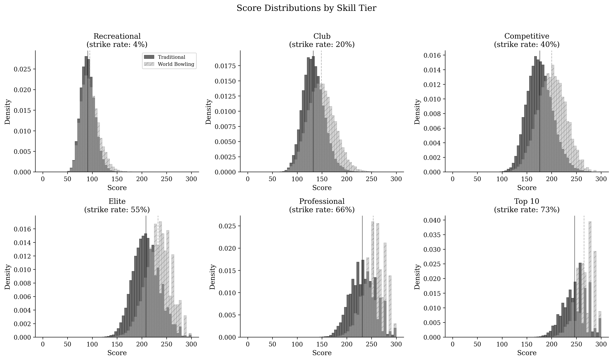
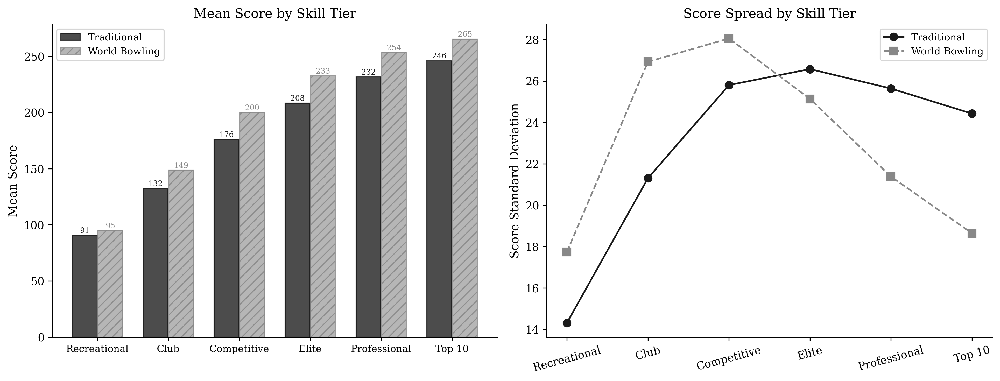
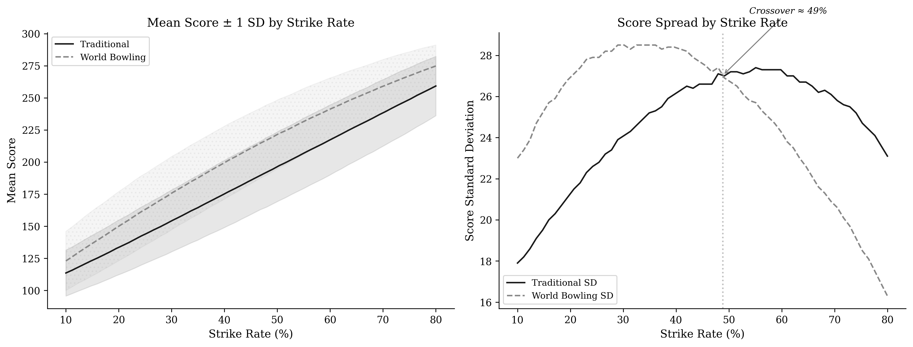
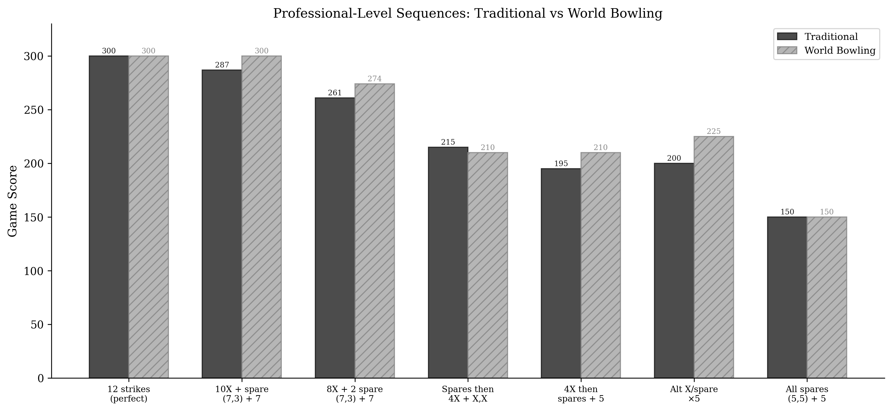

These results come from Monte Carlo simulations of 50,000 games per skill tier, using three progressively realistic models. For full details and the ability to re-run with your own parameters, see the [Colab notebooks](https://colab.research.google.com/github/michael-borck/skill-sequence-scoring/blob/main/notebooks/01_paper_results.ipynb).

## Skill Tiers

We simulate six skill levels, calibrated against USBC and PBA statistics:

| Tier | Strike Rate | Traditional Mean | World Bowling Mean |
|---|---|---|---|
| Recreational | 4% | ~91 | ~95 |
| Club | 20% | ~133 | ~149 |
| Competitive | 40% | ~176 | ~200 |
| Elite | 55% | ~209 | ~233 |
| Professional | 66% | ~232 | ~253 |
| Top 10 | 73% | ~246 | ~265 |

## Score Distributions by Tier

Notice how the distributions shift and compress differently under each system. At the recreational level, both systems produce similar shapes. At the professional level, World Bowling scores compress toward 300 while traditional scores maintain a wider spread.

## The Crossover Point

The key finding: **score spread crosses over at approximately 50% strike rate.**

- **Below 50%** (recreational, club): World Bowling provides *more* score spread. Its simplicity is a net benefit here.
- **Above 50%** (elite, professional): Traditional scoring provides *more* spread — over 30% more at the Top 10 level.

The right panel shows the crossover clearly — the standard deviation lines cross between Competitive and Elite levels.

## Robustness: Three Simulation Models

Does the finding hold if we make the simulation more realistic? We tested three models:

1. **Independent** — each ball is statistically independent (conservative baseline)
2. **Momentum** — strike probability shifts ±5% based on the previous frame
3. **Markov chain + spare difficulty** — state-dependent strike probabilities calibrated from PBA data, with leave-dependent spare conversion rates

All three models agree on the direction. More realistic models make the traditional scoring advantage *larger*, not smaller.

## Professional-Level Sequences

At the professional level, specific game sequences show large score differences between the systems. The systems agree at the extremes (perfect game, all spares) but diverge substantially for the mixed sequences that make up real competitive bowling.

Key observation: "4 strikes then spares" scores 195 under traditional but 210 under World Bowling. "Spares then 4 strikes" scores 215 traditional but 210 World Bowling. **Same frames, different order — traditional scoring encodes the difference, World Bowling erases it.**

## Want to explore further?

- **[Scoring Explorer](explorer.qmd)** — build your own frame sequences and see both scores live
- **[Reward Gradient](reward.qmd)** — see how the value of each consecutive strike changes
- **[Run on Colab](https://colab.research.google.com/github/michael-borck/skill-sequence-scoring/blob/main/notebooks/02_interactive_explorer.ipynb)** — adjust strike rates, spare rates, and model parameters with interactive sliders
